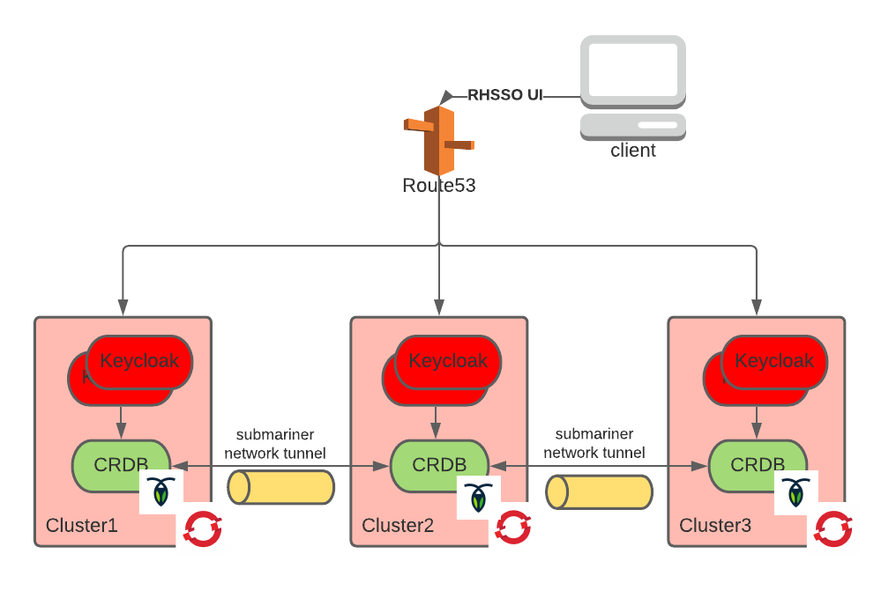
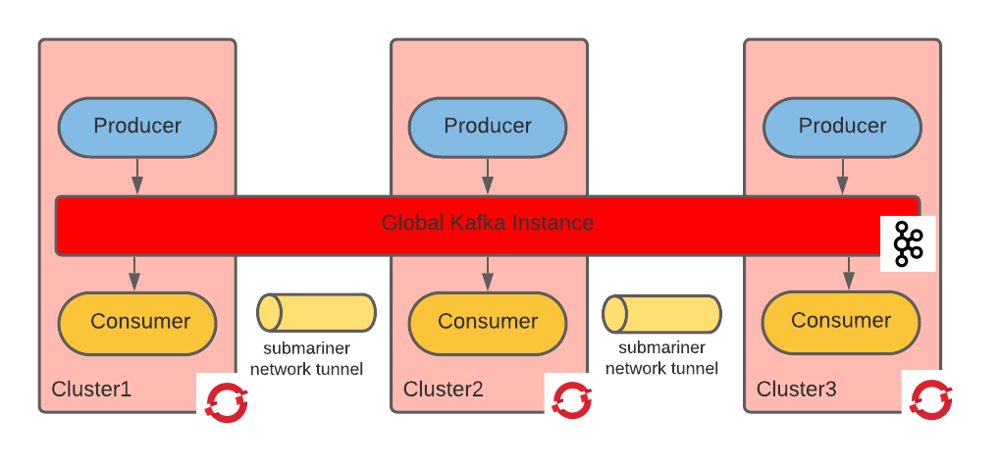
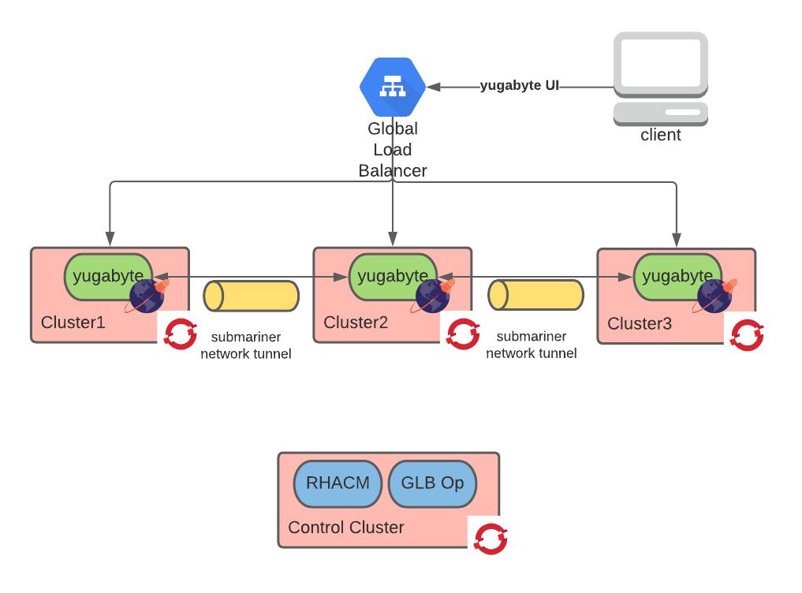

# OpenShift modern availability

This is a step by step tutorial to deploying stateful applications with high-availability and zero downtime DR (RTO,RPO~>0).
You will need a cluster and the ability to spawn new ones.
This tutorial works on AWS, but the concepts may be reused everywhere.

The resulting deployment will looks as this:

This tutorial is comprised of the following steps:

1. [cluster preparation](./cluster-preparation.md)

   This will result in deploying the following
   

2. [establishing trust](./establishing-trust.md) between the clusters

    This step requires having previously executed _cluster preparation_ step.

    The result of this step is the following:
    

3. [deploying cockroachdb](./cockroachdb.md)

    This step requires having previously executed _establishing trust_ step.

    The result of this step is the following:
    

4. [deploying keycloak](./keycloak.md)

    This step requires having previously executed _deploying cockroachdb_ step.

    The result of this step is the following:
    

5. [deploying kafka](./kafka.md)

    This step requires having previously executed _establishing trust_ step.

    The result of this step is the following:
    

6. [deploying YugabyteDB](./yugabyte.md)

    This step requires having previously executed _establishing trust_ step.

    The result of this step is the following:
    
